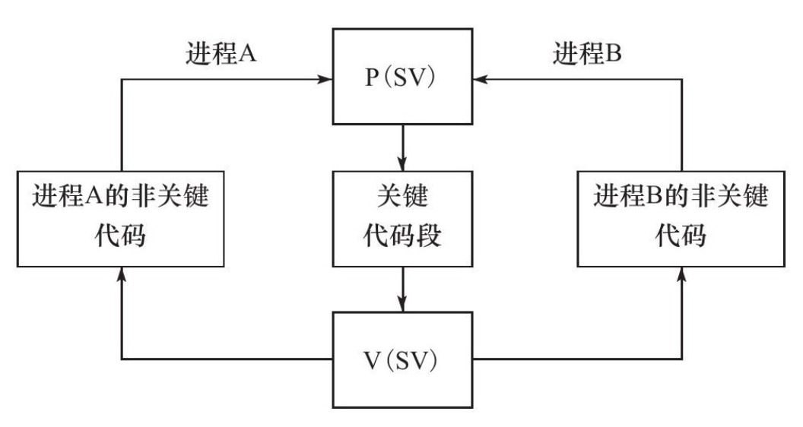

# Multi-process programming

5 parts:
- `fork` syscall and `exec` syscall
- zombie process and how to avoid
- IPC: pipe
- Semaphore, Message Queue, Shared Memory
- use UNIX socket to pass fd

## 13.1 fork syscall

```
#include <sys/types.h>
#include <unistd.h>
pid_t fork(void);
```

return twice, one in child process, return 0, one in parent process return child pid.

`fork` syscall will duplicate current process, creating new process table:
- same heap ptr
- same stack ptr
- same register value
- diff PPID
- diff signal

The child process will copy the parent process's data: copy-on-write
- stack data
- heap data
- static data

Open fds in the parent process is also open in the child process, and the reference number + 1

## 13.2 exec syscall

run other program in the child process

## 13.3 Handling zombie process

2 situations:
- the child process has ended, but the parent process has not called `waitpid()`
- the paent process exited, but the child process is running: the PPID will be set as 1, `init` adopted the process

```
#include <sys/types.h>
#include <sys/wait.h>
// wait for the child process to exit, store the exit info in stat_loc
pid_t wait(int* stat_loc); // blocking
pid_t waitpid(pid_t pid, int* stat_loc, int options); // options set as WNOHANG, non-blocking
```

## 13.4 pipe

can be used to pass data between the child process and the parent process

fd[0] and fd[1] are all open after `fork` syscall

close one in the parent process and another in the child process to communicate between the two processes

bidirectional comunication requires two pipes

`pipe` can only be used in two processes with relationship, like parent-child process

`IPC` can be used in processes with no relationship

## 13.5 semaphore

we want there be only one process writing a piece of memory at the same time

P, V:
- P(SV): if SV>0, SV--; if SV==0, SV hangup
- V(SV): if hangup, waken; else SV++;




Three semaphore related syscalls:
- semget
- semop
- semctl

### 13.5.2 semget

create or get a 
