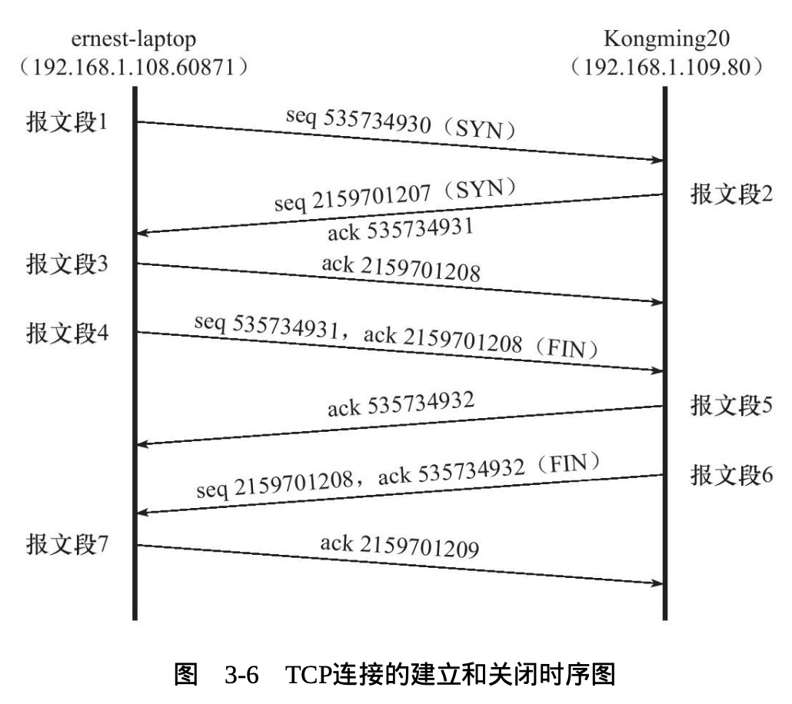

# Detailed TCP Protocol

4 parts:
- TCP header info
- TCP state tranformation
- TCP data stream: 交互数据流，成块数据流
- TCP data stream control: 超时重传，拥塞控制

## 3.1 TCP Service Characteristics

- 面向连接、字节流、可靠传输
- 全双工: 双方的数据读写通过一个连接进行
- 一对一连接，不支持多播和广播
- 发送端的写操作次数和接收端的读操作次数无关
  - 发送端应用程序连续执行写操作时，TCP模块先将数据放入TCP发送缓冲区中
  - 开始发送时，可能被封装成一个或多个TCP报文发送
  - 接收端收到数据时，放入TCP接收缓冲区中，通知应用读取数据
  - 应用可以一次读取也可以多次读取
- 可靠
  - 发送应答机制：每个发送的报文端都有ACK
  - 超时重传：发送时启动定时器
  - 重新排序，整理

## 3.2 TCP Header Structure

### 3.2.1 TCP Header Structure(20 Bytes)

- Port Number(16bit): Source port number and Target port number. Clients tend to use temporary port, Server used defined port.
- Seq Number(32bit): ISN(Initial Sequence Number), following TCP segments' Seq number = ISN + the offset of the first byte
- Ack Number(32bit): Received Seq Number + 1
- Header Length(4bit): TCP header at most 60 bytes
- Flags:
  - URG: if urgent pointer is valid
  - ACK: if ack number is valid
  - PSH: receiver application should instantly read all the data from TCP buffer
  - RST: ask to re-establish the connection
  - SYN: ask to make a connection
  - FIN: ask to close the connection
- Window Size(16bit): Flow Control, tell the other side who many bytes of data TCP buffer can contain
- TCP checksum
- Urgent Pointer: used to send TCP urgent data

### 3.2.2 TCP Header Options(at most 40 Bytes)

- Kind(1byte): option kind
- Length(1byte): the length of the option field(optional)
- Info(nbyte): (optional)

Kind:
- 0: end option
- 1: nop option, 用于将option大小填充到4的整数倍
- 2: MSS option, MSS(Max Segment Size), used to negotiate the MSS. Usually, MSS = MTU-40, 40 == Header of IP and TCP
- 3: Window Expand Factor option, used to increase the throughput of TCP communication. Supposed Window Size = N, Expand Factor Size = M, Real Size of the window will be N<<M
- 4: SACK(Selective Acknowledgement), during re-sending, only re-send lost segments instead of all the segments
- 8: timestamp, to calculate the RTT

```
In syncronization segment, win stands for the actual window size.
In other segments, win stands for remaining window size.
```

## 3.3 The establishment and close of TCP connection


### 3.3.1 Use tcpdump to observe the TCP establishment and closing



As we can see from above, two ISNs will be generated by the host and the client.

All the following seq numbers are the ISNs + offset.

Usually, connection is made by the client by three-way shakehand. However, closing is made by the client or the host.

### 3.3.2 Half Close

Half close is a state where one side of the connection has finished sending message. It will send a FIN to the other side. But it can still receive data from the other side.

### 3.3.3 Connection Timeout

If the network is busy, the sender does not receive the ack from the receiver, it will firstly do the reconnection.

If reconnection fails, it will tell the application that the connection is timeout.

重连间隔时间为1s, 2s, 4s, 8s, 16s, 32s，每次重连时间翻倍。

## 3.4 TCP state transformation


