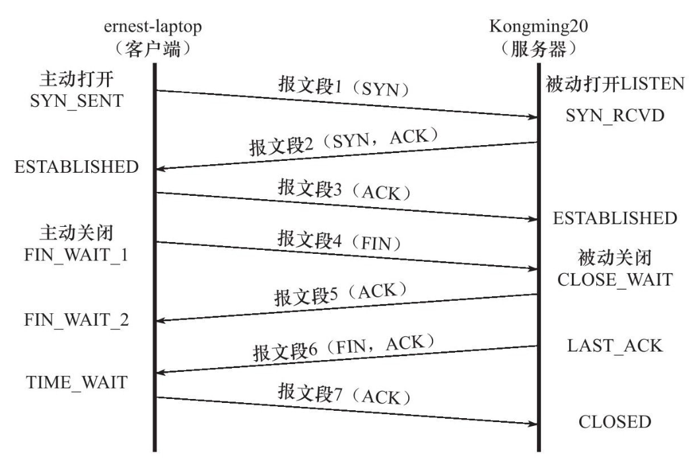
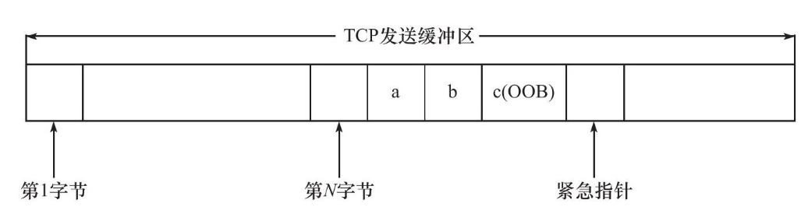

# Detailed TCP Protocol

4 parts:
- TCP header info
- TCP state tranformation
- TCP data stream: 交互数据流，成块数据流
- TCP data stream control: 超时重传，拥塞控制

## 3.1 TCP Service Characteristics

- 面向连接、字节流、可靠传输
- 全双工: 双方的数据读写通过一个连接进行
- 一对一连接，不支持多播和广播
- 发送端的写操作次数和接收端的读操作次数无关
  - 发送端应用程序连续执行写操作时，TCP模块先将数据放入TCP发送缓冲区中
  - 开始发送时，可能被封装成一个或多个TCP报文发送
  - 接收端收到数据时，放入TCP接收缓冲区中，通知应用读取数据
  - 应用可以一次读取也可以多次读取
- 可靠
  - 发送应答机制：每个发送的报文端都有ACK
  - 超时重传：发送时启动定时器
  - 重新排序，整理

## 3.2 TCP Header Structure

### 3.2.1 TCP Header Structure(20 Bytes)

- Port Number(16bit): Source port number and Target port number. Clients tend to use temporary port, Server used defined port.
- Seq Number(32bit): ISN(Initial Sequence Number), following TCP segments' Seq number = ISN + the offset of the first byte
- Ack Number(32bit): Received Seq Number + 1
- Header Length(4bit): TCP header at most 60 bytes
- Flags:
  - URG: if urgent pointer is valid
  - ACK: if ack number is valid
  - PSH: receiver application should instantly read all the data from TCP buffer
  - RST: ask to re-establish the connection
  - SYN: ask to make a connection
  - FIN: ask to close the connection
- Window Size(16bit): Flow Control, tell the other side who many bytes of data TCP buffer can contain
- TCP checksum
- Urgent Pointer: used to send TCP urgent data

### 3.2.2 TCP Header Options(at most 40 Bytes)

- Kind(1byte): option kind
- Length(1byte): the length of the option field(optional)
- Info(nbyte): (optional)

Kind:
- 0: end option
- 1: nop option, 用于将option大小填充到4的整数倍
- 2: MSS option, MSS(Max Segment Size), used to negotiate the MSS. Usually, MSS = MTU-40, 40 == Header of IP and TCP
- 3: Window Expand Factor option, used to increase the throughput of TCP communication. Supposed Window Size = N, Expand Factor Size = M, Real Size of the window will be N<<M
- 4: SACK(Selective Acknowledgement), during re-sending, only re-send lost segments instead of all the segments
- 8: timestamp, to calculate the RTT

```
In syncronization segment, win stands for the actual window size.
In other segments, win stands for remaining window size.
```

## 3.3 The establishment and close of TCP connection


### 3.3.1 Use tcpdump to observe the TCP establishment and closing


As we can see from above, two ISNs will be generated by the host and the client.

All the following seq numbers are the ISNs + offset.

Usually, connection is made by the client by three-way shakehand. However, closing is made by the client or the host.

### 3.3.2 Half Close

Half close is a state where one side of the connection has finished sending message. It will send a FIN to the other side. But it can still receive data from the other side.

### 3.3.3 Connection Timeout

If the network is busy, the sender does not receive the ack from the receiver, it will firstly do the reconnection.

If reconnection fails, it will tell the application that the connection is timeout.

重连间隔时间为1s, 2s, 4s, 8s, 16s, 32s，每次重连时间翻倍。

## 3.4 TCP State Transition

### 3.4.1 State Transition



#### Server side

**Establishment:**
1. Enter LISTEN state by calling listen syscall
2. Enter SYN_RCVD state when get SYN segment, and put the connection into kernel waiting sequence
3. Enter ESTABLISHMED state when received ACK segment

**Close:**
1. Enter CLOSE_WAIT state when receiving FIN then return ACK segment
2. Enter LAST_ACK state when sending FIN to the client

#### Client side

**Establishment:**
1. Enter SYN_SENT state by calling connect syscall to send a SYN segment to the server:
  - if the port doesn't exist, the server will return an RST segment
  - if the port exist but timeover, connect also fails
2. Enter ESTABLISHED if the connect is successful

**Close:**
1. Enter FIN_WAIT_1 after sending a FIN to the server
2. Enter FIN_WAIT_2 after receiving an ACK from the server
3. Enter TIME_WAIT when receiving an FIN from the server

Notice:
1. Client can directly enter TIME_WAIT from FIN_WAIT_1 if the server sends ACK and FIN at the same time
2. Client may stuck at FIN_WAIT_2 when the client force to exit before getting the FIN from the server. The connection will be transferred to the kernel, called orphan connection:
  - /proc/sys/net/ipv4/tcp_max_orphans
  - /proc/sys/net/ipv4/tcp_fin_timout

### 3.4.2 TIME_WAIT State

After receiving an FIN from the server, the client will enter TIME_WAIT state and wait for 2MSL(Max Segment Life) until closing.

Reasons for TIME_WAIT:
1. If the ack the client sends to the server is lost, the server will re-send FIN, so the client should stay in TIME_WAIT to handle this condition.
2. The port possesed by the TIME_WAIT will not be reused. If there's no TIME_WAIT state, the application can instantly establish a connection similar to the recently closed connection, which will receive data of the former connection.
3. If the ACK to the server is lost, the client needs 2MSL to receive another FIN from the server.

## 3.5 RST Segment

Tell the other end to close or re-establish the connection.

### 3.5.1 Visiting Non-existing Port

When the client is visiting a non-exisiting port, the server will return an RST segment.

When the port is in TIME_WAIT state, it will also return an RST segment.

### 3.5.2 Exception Terminate Connection

Once an RST is sent, all the data in the sending sequence will be drop.

### 3.5.3 Handling Half Open Connection

Half Open: The client sends an RST to the server, but the RST is lost. The client is closed but the server is still sending data to the client. The client will return RST to the server.

## 3.6 TCP Interactive Data Flow

Interactive data flow only contains small amount of bytes, high demand for real-time, like telnet, ssh.

Block data flow contains longest data size of TCP segment, high transmission efficiency, like ftp.

延迟确认：指服务端在返回ACK时会等待服务器端是否有数据要发送给客户端，可以减少TCP报文端的量

Nagle Algorithm:
- 通信双方在任意时刻都最多只能发送一个未被确认的TCP报文段
- 发送方在等待确认的同时收集本端需要发送的微量数据，到来时用一个TCP报文段全部发出

优点:
- 减少了微小TCP报文段的数量
- 确认到达的越快，数据发送得越快

## 3.7 TCP Block Data Flow

The sender will send multiple TCP segments, and the receiver will acknowledge all these segments at one time.

The number of TCP segments is decided by receive window size. If win==30084, it means that the client can receive 30084 << winScale bytes 

## 3.8 OOB(Out Of Band) Data

OOB data is to tell the other side the important events, so it has higher priority.

UDP doesn't have OOB data, TCP use URG pointer to represent OOB data.



If TCP module uses multiple TCP segments to send the buffer above, every TCP segment will set URG flag, but only one TCP segment has real OOB data.

OOB cache(1bit), if the upper layer application doesn't read the buffer on time, it will be overwritten by the following OOB data.

## 3.9 TCP timeover retransimission

TCP module sets a timeover timer for each TCP segment. The timer starts when the TCP segment is sent. If the time is over, TCP module will reset the timer and resend the segment.

Re-transmission:
1. 5 times retransmissions, time gap 0.2s, 0.4s, 0.8s, 1.6s, 3.2s(grow in times, similar to reconnection)
2. give to IP and ARP

## 3.10 Congestion Control

### 3.10.1 Congestion Control

Congestion Control: Increase Network Use Rate, Decrease Loss Rate

Congestion Control Mechanism:
- Slow start
- Congestion avoidance
- Fast retransmit
- Fast recovery

Some property:
- SWND(Send Window), the only data to control, SWND = MIN(RWND, CWND)
- SMSS(Sender Max Segment Size), usually == MSS
- RWND(Receive Window)
- CWND(Congestion Window)

Modify SWND size:
- If SWND is too large, it will cause network congestion.
- If SWND is too small, it will cause network delay.

### 3.10.2 Slow start and Congestion avoidance

#### Slow Start

After the TCP connection is established, CWND will be set to IW(Initial Window), 2-4SMSS

```
CWND += min(N, SMSS) # N is the segment number which got acknowledged in the ACK
```

#### Congestion avoidance

When CWND is over `ssthresh`, it will enter Congestion avoidance stage, linear increase.

How does the Sender detect the congestion?
1. Transmission timeover
2. Get duplicated ACK

If the first situation, 
```
ssthresh = max(FlightSize/2, 2*SMSS)
CWMD <= SMSS
```

### 3.10.3 Fast re-transmission and Fast recovery

Get duplicated ACKs:
- TCP segment lost
- get unordered TCP segments

If the sender gets 3 duplicated ACKs in sequence, there's a congestion.

Procedure:
1. When getting the third duplicated ACK, `ssthresh = max(FlightSize/2, 2*SMSS); CWND = ssthresh + 3*SMSS`
2. Everytime the sender gets a duplicated ACK, set `CWND=CWND+SMSS`
3. When receive new ACK, set `CWND=ssthresh`


