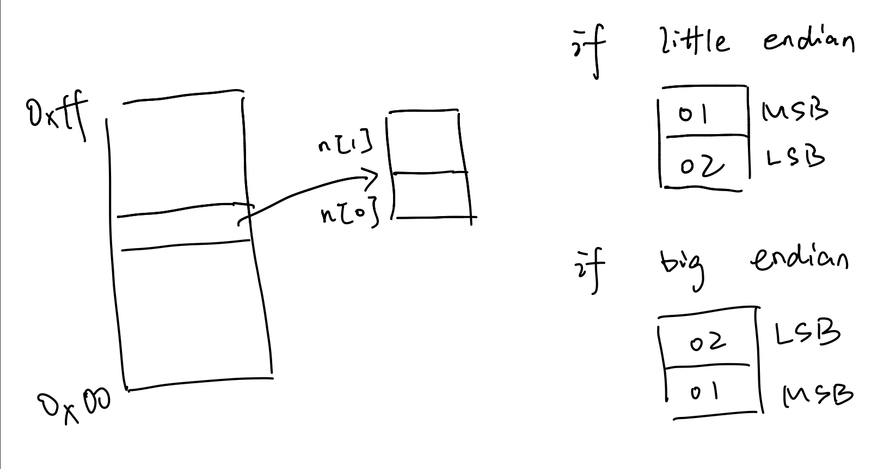

To judge if the machine is big endian or little endian

Use the `union`, which store different types of data in the same piece of memory.

If in little endian, `0x0102` 1 should be in higher memory, 2 should be in lower memory, vice versa.

