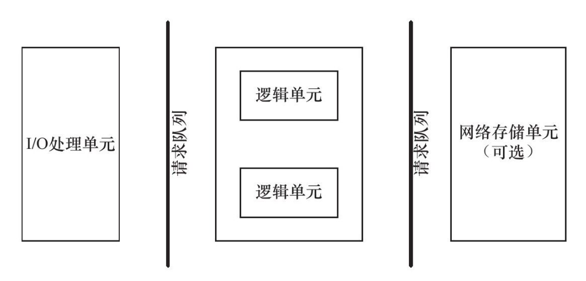
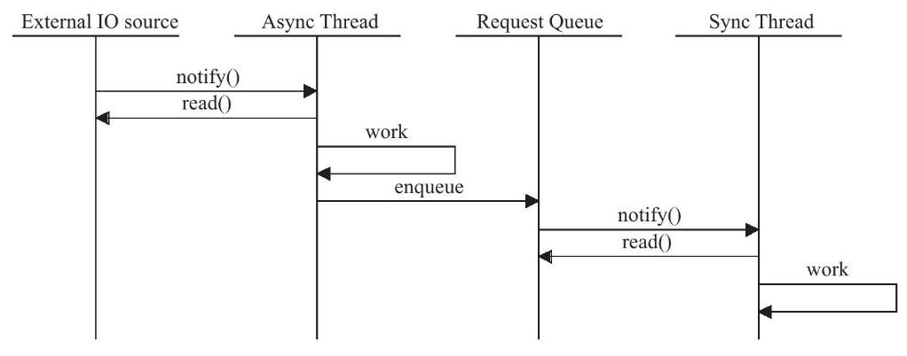
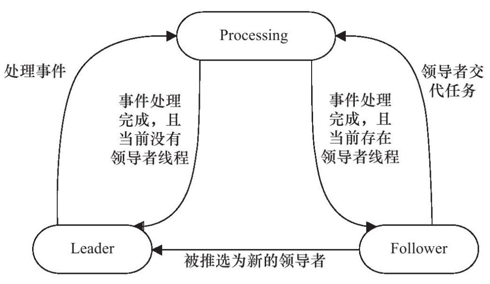

#High-performace Server Program Framework

A server includes:
- I/O parsing module
- Logic module: two high-performance concurrency models and FSM
- Storage module

## 8.1 Server Model

### 8.1.1 C/S Model

One Server, Multiple Clients

Logic:
1. Server starts, creates one or more listening socket, uses `bind` to bind it to the port
2. Use `listen` to wait for client connecting
3. The client can use `connect` to make connection with the server

The connection request from the client is an asyncronized event, so we need some I/O models to handle it.

C/S model is suitable for resource-centered situation.

### 8.1.2 P2P Model

Every machine can share resource between each other.

But when the transimission grows, the burden of the network will increase.

Need a discover server for helping finding each other.

## 8.2 Server Programming Framework

### I/O parsing unit

- for single server: handle user connection, read/write data
- for servers: connection servers, balance the burden

Jobs:
- wait and accept new client connection
- receive client data
- return server response back to the client

**receivig and sending data is not necessarily in I/O parsing unit, might in Logic Unit: Reactor**

### Logic Unit

- for single server: process or thread
- for servers: logic server

Jobs:
- parsing data
- give the result to I/O parsing unit or directly send to the client

### Network Storage Unit

- for single server: local database, file or cache
- for servers: database server

### Request queue

- for single server: communication between different units
- for servers: permanent TCP connection between servers

Pool

## 8.3 I/O Model

Socket is in default blocking, we can set it non-blocking.

**Blocking I/O:**
- syscall towards blocking I/O might be hang up until the event is over
- for example: the client use `connect` to connect the server, waiting for the server's ACK, if the client cannot get ACK immediately, it will be hang up

**Non-Blocking I/O:**
- syscall towards non-blocking I/O always return immediately
- if the event doesn't happen immediately, return -1 set errno:
  - If the event doesn't happen, set EAGAIN or EWOULDBLOCK
  - If the event is in progress, set EINPROGRESS
- in the case above, `connect` will return -1 and set errno as EINPROGRESS

Only when the event is in progress will non-blocking increase the efficiency.

Non-blocking I/O should be used with other mechenisms like I/O multiplexing or SIGIO signal

### I/O Multiplexing

1. Application registers a group of event to the kernel by I/O multiplexing functions: select, poll, epoll
2. The kernel will use the functions to send the ready events to the applications

**I/O Multiplexing function is blocking but they have the ability to listen on multiple I/O events**

### SIGIO

SIGIO can also be used to report I/O events.

## 8.4 Two high-performace Event Handling Models

Three kinds of events for the server to handle:
- I/O event
- Signal
- Schedule event

Two models:
- Reactor: syncronize
- Proactor: asyncronize

### 8.4.1 Reactor

- Main thread: I/O Parsing Unit
- Working thread: Logic Unit

Reactor asks I/O parsing unit to only listen on if there's any event happen on the file descriptors, if so, tell the logic unit.

Logic Unit is responsible for read/write data, accepting new connection and parsing user request.

### 8.4.2 Proactor

Proactor gives all the I/O work to the main thread and the kernel.

1. `epoll_wait` listens only on connection request
2. Main thread registers read finish event and tell the kernel where the user space buffer is and how to inform the application
3. When the data is written to the user buffer, the kernel will send a signal to the application
4. The application will parse the request and use `aio_write` to register a write finish event and tell the kernel where the user write buffer is and how to tell the application when finish
5. When the data is written to the socket, the kernel will send a singal to the application
6. the application will parse the signal

### 8.4.3 Simulating Proctor using syncronizing

1. Main thread writes read ready event to the kernel.
2. Main thread calls `epoll_wait` to wait for socket data
3. Main thread will read the data into the request queue.
4. Working thread will handle the request, and register a write ready event
5. Main thread will call `epoll_wait` to wait for socket writable.
6. When the socket is writeable, `epoll_wait` will tell the main thread and the main thread will write the result to the socket.

## 8.5 Two high-performace Concurrency Models

Concurrency is efficient when the program is I/O bound.

Concurrency:
- Multi-process
- Multi-thread

Two models:
- half-sync/half-async
- leader/followers

### 8.5.1 Half-sync/Half-async

The sync/async here is different from those in I/O.

In I/O, sync means:
1. the kernel will inform the application of `ready` event instead of `finish` event
2. read/write by the application instead of the kernel

In Concurrency, sync means:
1. execute by the code sequence instead of the system events like interrupt, signal.

- Sync thread has low efficiency but high realtime feature
- Async thread has high efficiency but low realtim feature and complex

So we need to use half-sync/half-async:
- async thread to handle I/O unit, sync thread to handle logic unit
- When async thread gets client reuqest, put it into request queue
- request queue tells a sync working thread to handle the event

### 8.5.2 Leader/Followers

At any time, there is only one leader.

When the leader detects the I/O event, it will elect a new leader thread and handle the I/O event.
Now the old leader handles the event while the new leader is waiting for new I/O events.

Serveral parts:
- HandleSet
- ThreadSet
- EventHandler
- ConcreteEventHandler

Handle is the I/O resources, file descriptors in linux

ThreadSet includes Leader, Processing, Follower.

## 8.6 FSM

CHECK_STATE:
- CHECK_STATE_REQUESTLINE
- CHECK_STATE_HEADER

LINE_STATEUE:
- LINE_OK
- LINE_BAD
- LINE_OPEN

HTTP_CODE:
- NO_REQUEST
- GET_REQUEST
- BAD_REQUEST
- FORBIDDEN_REQUEST
- INTERNAL_REQUEST
- CLOSED_CONNCECTION

## 8.7 Other Strategies to Improve Server Performance

### 8.7.1 Pool

Use space resource to trade time efficiency

Pool is a set of resources, is initialized on the start of the server, static resource.

When parsing client request, the server can get resource from the pool instead of calling relevant syscalls, which costs time.

When the parsing is over, we can put the resource back to the pool.

Pool is in the application layer of server, we need to give enough resource to the pool.

**Different kinds of pool**
- memory pool: socket receive buffer, socket send buffer
- process pool, thread pool: when parsing client request, get a thread or process from the pool instead of dynamic calling `fork` or `pthread_create`
- connection pool: permanent connection between servers

### 8.7.2 Data Copy

Avoid unnecessary data copying, especially those between user space and kernel space.

If there does not involve any parsing of the data, like ftp, we can directly use kernel to do the work instead of copying it to the user space.

### 8.7.3 Context Switch and Lock

We must think about context switching when doing concurrency, avoiding context switching.

Lock: If we have to use lock, decrease the granularity of lock.

